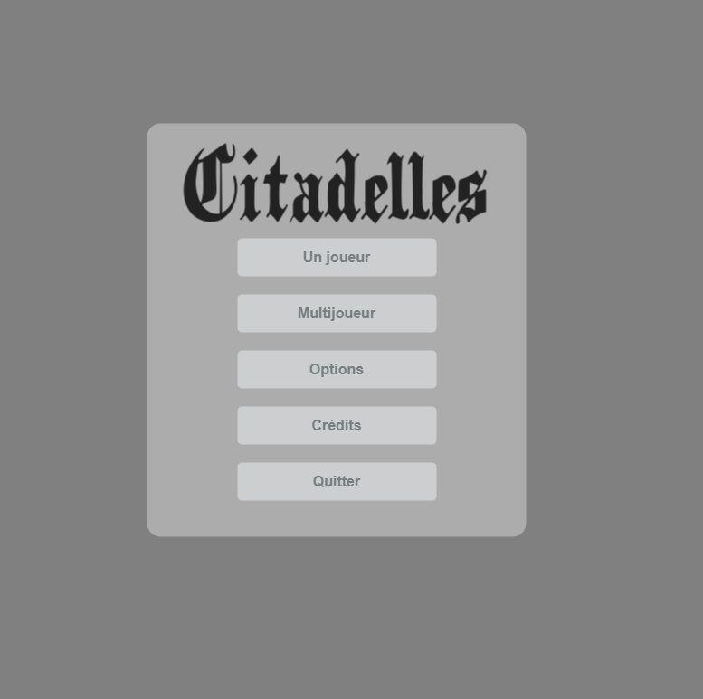
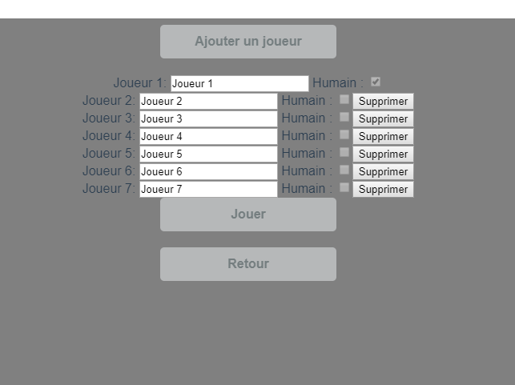
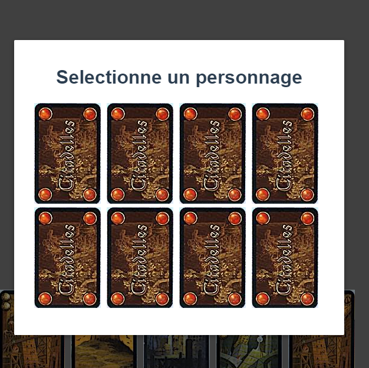
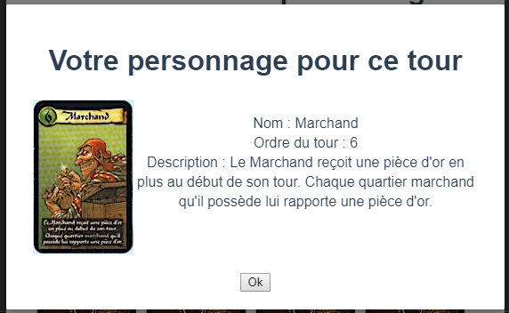
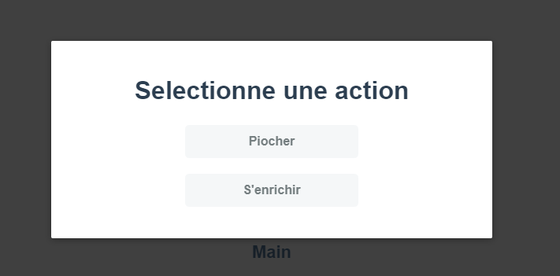
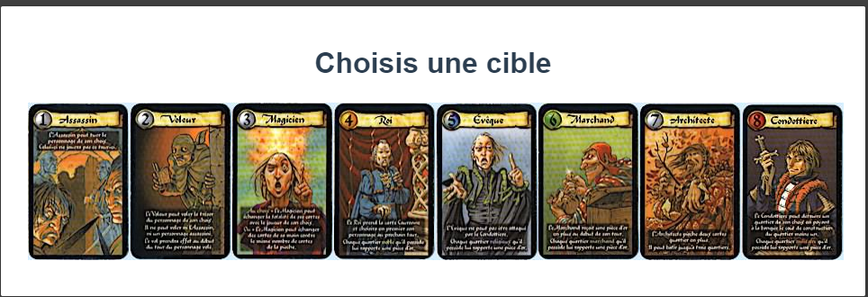
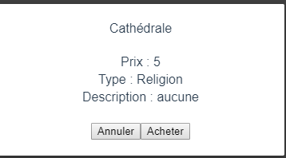
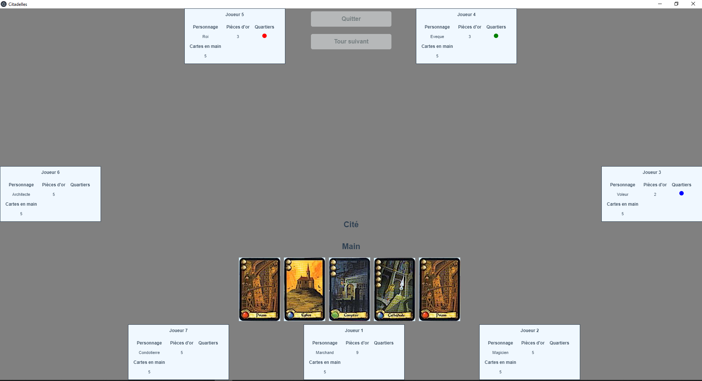

# Citadelles
Le projet "Citadelles" consiste à une version numérique du jeu de carte original éponyme "Citadelles".

## Le projet
Ce jeu est notre projet de fin de bachelor 3. C'est un jeu de cartes qui demande de la réflexion mais qui reste amusant et sans prise de tête entre amis. Il convient parfaitement aux petits comme aux grands. Il est aussi possible de faire des parties qui sont rapides , pratique quand on n'a pas beaucoup de temps.

## Technologies utilisées
- Vue : pour l'interface graphique (la gestion des évenements et le visuel)
- Electron : pour faire une interface graphique avec des langage web tout en gardant un 'aspect logiciel' avec une fenêtre
- Jest : pour les tests unitaires
- TypeScript : pour typer nos données, toujours savoir ce qu'on attend en entrée et ce qu'on envoie en sortie
- NodeJs : pour la base du projet, l'intégration des librairies, lier toutes les parties de notre projet
- MongoDB : pour la base de données (utilisé avec l'ORM mongoose), qui permet d'être plus flexible qu'avec un SGBDR classique (ce dont on a besoin pour le projet)

## Installation de l'environnement de développement
Prérequis :
- npm 6.13.4
- nodejs 12.14.1
- optionnellement yarn 1.21.1 

```
$ git clone https://github.com/paralixo/Citadelles.git 
$ cd citadelles
// ou npm install
$ yarn install
// ou npm run electron:serve
$ yarn electron:serve
```

Pour lancer le projet il n'est pas obligatoire de l'installer l'environnement de développement.
On peut simplement lancer l'installateur à la racine du projet.

## Le jeu
Voici les règles du jeu sur lesquelles nous nous somme basés: http://jeuxstrategie.free.fr/Citadelles_complet.php

Effectivement, le jeu possédant 4 éditions différentes et plusieurs extensions les règles ont été modifiés plus d'une fois. 

## Déroulement type d'un tour de jeu
Voici le déroulement 'basique' d'un tour de jeu.

1) Le joueur selectionne un personnage au hasard. 
2) Il choisit ensuite entre piocher deux cartes et en défausser une ou gagner trois pièces d'or. 
3) Après cela il peut choisir d'acheter un quartier de sa main contre les pièces d'or spécifiées sur le quartier. 
4) Au bout de huit quartiers posés sur le terrain d'un joueur, on attend la fin du tour de table. On compte alors les points. Le joueur ayant le plus de point remporte la partie.

On peut ajouter de nombreuses actions pendant un tour selon :
- notre personnage, certains ont des pouvoirs passifs, d'autres ont des pouvoirs actifs
- les quartiers posés devant nous, certains quartiers nous offre de nouvelles possibilités pendant notre tour

Ces capacités étant très situationnelles, nous vous invitons à lire les spécificités présentés dans les règle (cf. lien au début de la section).

## Présentation du jeu
Dans Citadelles, le but est de bâtir une cité prestigieuse avant que vos adversaires ne parviennent à construire la leur. Pour développer votre ville et de nouveaux quartiers, il vous faudra bien sûr de l’or, mais aussi le soutien des notables locaux, roi, échevin, cardinal, patricien ou archiviste, et parfois aussi de la lie de la cité, voleur, espion, assassin ou sorcière.

Citadelles est un jeu de bluff, d’intrigues et de stratégie. Les joueurs amassent de l’or qu’ils dépensent ensuite pour bâtir les quartiers qui composent leur cité médiévale. À la fin de la partie, le joueur qui a constitué la plus belle, la plus grande, la plus prestigieuse cité est vainqueur.
Citadelles est un jeu de stratégie qui se déroule dans un monde médiéval fantastique. Vous devez construire la plus grande et la plus belle ville du monde, avec différentes cartes qui représentent les quartiers: Université, Château, Cathédrale etc.

Pour réaliser cela, vous serez tour à tour l'un des plus puissants personnages de la ville, le Roi, l'Evèques, le Marchand etc. Mais il n'est pas facile de construire une Citadelles prospère et unique: cela nécessite richesses, ambition et filouterie.

Les parties sont toutes différentes et il vous faudra user de tactique et de ruse pour parvenir au succès en évitant le coups tordus des autres joueurs (vol, assassinat).

Chaque joueur développe une cité pour la rendre la plus riche et la plus prestigieuse. Vous construisez des quartiers à l'aide de cartes que vous exposez devant vous.
A chaque tour, les joueurs doivent incarner un personnage doté d'un pouvoir particulier : construire plus vite, détruire un quartier, assassiner, voler, remplir son trésor, protéger sa cité, piocher plus de cartes .

Pourrez-vous deviner quels sont les personnages choisis par les autres joueurs ? Serez-vous victime de l'assassin ou du voleur ? A moins que vous ne soyez vous-même l'assassin ou le voleur!

Rebondissements, coups tordus et ruses sont les points forts de Citadelles. Les règles sont simples et accessibles et on se plonge volontiers dans l'ambiance médiévale.

## Routes
### API de la base de données :
"localhost:3000" 
Chaque model possède 4 verbes http : 
- get
- post
- delete
- patch

```/character``` : Permet d'obtenir la liste des personnages.

```/deck``` : Permet d'avoir la liste des cartes des deck sous forme d'id.

```/district``` : Permet d'avoir la liste des cartes de quartier.

```/player``` : Permet d'avoir la liste des players ainsi que de leurs informations.

```/type``` : Permet d'avoir la liste des differents types de quartier.

### API Du jeu "localhost:3001" :

```/initialize ``` : Permet d'initialiser la partie.

```/generateCharacters``` : Permet de générer le deck de personnages.

```/player/:name/character/:position``` : Assigne une carte de personnage dans le deck de personnages à un joueur.

```/player/:name/choice/:choice```: Permet de choisir entre : prendre de l'argent (3 pièces d'or) ou de piocher deux cartes et les      mettre dans la main 'temporaire' du joueur au debut de son tour de jeu.

```/player/:name/discard/:choice```: Permet de choisir une carte à ajouter de la main temporaire à la main 'définitive' du joueur.

```/player/:name/buy/:choice```: Achète un quartier à acheter depuis la main.

```/player/:name/startTurn```: Permet de cibler un joueur avec le voleur ou l'assassin.

```/player/:name/magician/:choice``` : Active un des pouvoir du magicien.

```/player/:name/condottieri``` : Active le pouvoir de la condottière

```/player/:name/victory``` : Met le joueur dans le mode 'isFinished'./

```/player/:name/countPoints``` : Permet de donner le score du joueur à la fin de la partie.

```/player/:name/computer/choiceBeginning``` : L'ordinateur de faire son choix de début de tour en fonction des cartes et de l'argent qu'il possède.

```/player/:name/computer/buyDistrict``` : L'ordinateur de choisir 1 quartier à acheter, si il en a la possibilité, en fonction des cartes et de l'argent qu'il possède.

```/player/:name/laboratory/:choice``` : Active le pouvoir du laboratoire si il est posé sur le terrain du joueur.

```/player/:name/manufacture``` : Active le pouvoir de la manufacture si elle est posé sur le terrain du joueur.

## IHM
### Menu principal


### Création de la partie


### Choix Aléatoire du personnage


### Affichage du personnage choisi


### Action de début de tour


### Ciblage du voleur ou de l'assassin


### Achat d'un quartier


### Plateau de jeu


## Management du projet
- Dans un premier temps nous nous sommes concerté afin de mettre le projet au clair. (Choix technologiques, outils).

- Nous avons ensuite fait des usersStorys que nous avons retranscrit au propre sur notre GitLab. *Note: Gitlab nous ayant laché pendant le projet nous avons migré sur GitHub et avons perdu les users story*

- Nous avons mis en place un Github avec un bot Discord et des règles afin de pouvoir valider mutuellement nos travaux.

- Pour la répartition des taches nous faisions dans l'ordre de ce qu'on avit décidé au début. Le but etant de travailler chacun sur une fonctionnalitée différente a chaque fois.

## Contribution
Developpeurs : Clément MEHAYE et Florian LAFUENTE

Citadelles est un jeu édité par : Edge Entertainment-Ubik

## Contacts
Clément MEHAYE : clement.mehaye@ynov.com
Florian LAFUENTE : florian.lafuente@ynov.com